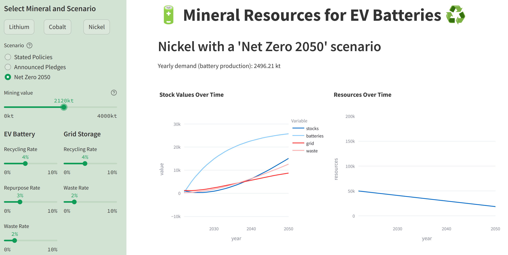

# 🔋 Simulation of Mineral Resources for EV Batteries ♻️

Authors: Melanie Bigler | Adrian Imfeld | Emir Odic | Valentin Muller

This project has been realized in the "Sustainability Analytics" seminar at Lucerne University of Applied Sciences and Arts (HSLU) in February 2024.

For details on the project, please refer to the project report.

## User Interface

## Installation

1. Clone the repository
2. Use a python 3.11 environment and install the required packages with `pip install -r requirements.txt`
3. Run the dashboard with `streamlit run dashboard.py`

